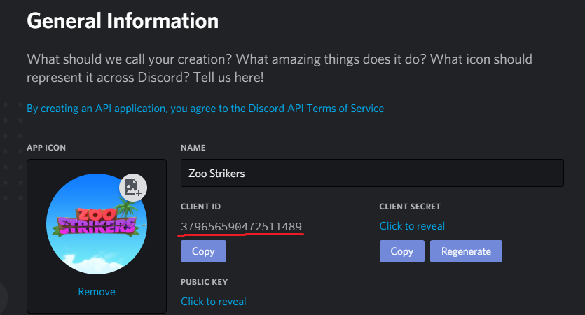
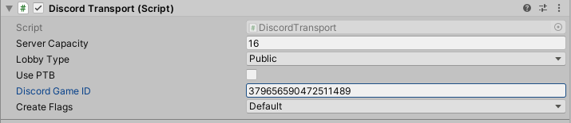

# Discord-Mirror Transport

Discord-Mirror is a networking transport for [Mirror](https://github.com/vis2k/Mirror) that enables sending networking packets via [Discord's Game SDK](https://discordapp.com/developers/docs/game-sdk/sdk-starter-guide).

## Why?

The point of this is for if you plan on releasing your game on Discord. This also provides benefits like:
* All UDP, including RUDP
* Encrypted through discords backend
* No IP leaks

## Prerequisites

For this to properly work, you do need the following things install into your unity project, The releases already have everything in them so if you prefer it all setup for you then grab a release.

* [Mirror](https://github.com/vis2k/Mirror)
* [Discord's Game Sdk](https://discordapp.com/developers/docs/game-sdk/sdk-starter-guide)
* [Latest Discord-Mirror](https://github.com/Derek-R-S/Discord-Mirror/releases)

## Setting Up

First, you need an application on Discord. Create one [here](https://discordapp.com/developers/applications) like so:


Second, copy the client ID and put that in the transport as Discord Game ID:




In the Discord application dashboard, you can whitelist people to test your game!

## Connecting

To connect to a server, you need a connect uri. The host can get it by calling.
```c#
Transport.activeTransport.ServerUri();
```
The clients can also get the activity secret by matchmaking, but thats something you need to create.

If you prefer to use regular secrets, you can set the activity secret and join by setting the NetworkManager address to the secret and call NetworkManager.StartClient()

## License
[MIT](https://choosealicense.com/licenses/mit/)