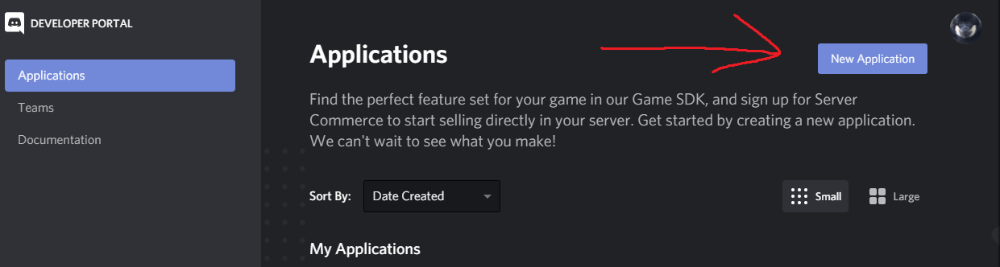

# Discord-Mirror Transport

Discord-Mirror is a networking transport for [Mirror](https://github.com/vis2k/Mirror) that enables sending networking packets via [Discord's Game SDK](https://discordapp.com/developers/docs/game-sdk/sdk-starter-guide).

## Why?

The point of this is for if you plan on releasing your game on Discord. This also provides benefits like:
* All UDP, including RUDP
* Encrypted through discords backend
* No IP leaks

## Prerequisites

For this to properly work, you do need the following things install into your unity project.

* [Mirror](https://github.com/vis2k/Mirror)
* [Discord's Game Sdk](https://discordapp.com/developers/docs/game-sdk/sdk-starter-guide)
* [Latest Discord-Mirror](https://github.com/Derek-R-S/Discord-Mirror/releases)

## Setting Up

First, you need an application on Discord. Create one [here](https://discordapp.com/developers/applications) like so:



Second, copy the client ID and put that in the transport as Discord Game ID:


In the Discord application dashboard, you can whitelist people to test your game!

## Connecting

To connect to a server, you need the lobby activity secret. The host can provide this for you by calling
```c#
((DiscordTransport)Transport.activeTransport).GetConnectString();
```
The clients can also get the activity secret by matchmaking, but thats something you need to create.

## License
[MIT](https://choosealicense.com/licenses/mit/)